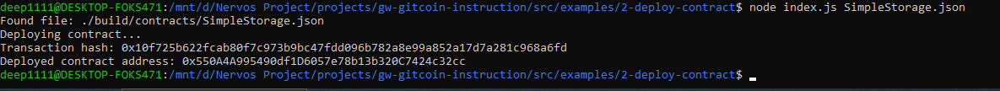

## 1. A screenshot of the console output immediately after you have successfully deployed a smart contract.

## 2. The transaction hash from the contract deployment (in text format).
0x10f725b622fcab80f7c973b9bc47fdd096b782a8e99a852a17d7a281c968a6fd
## 3. The deployed contract address from the contract deployment (in text format).
0x550A4A995490df1D6057e78b13b320C7424c32cc
