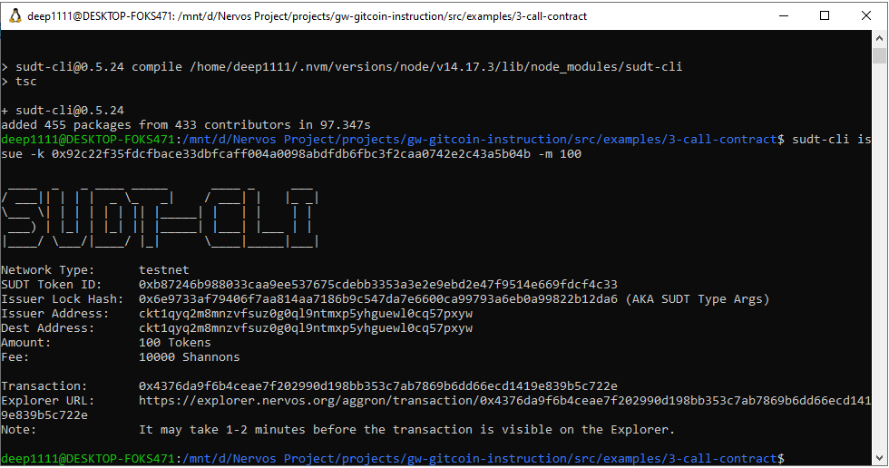
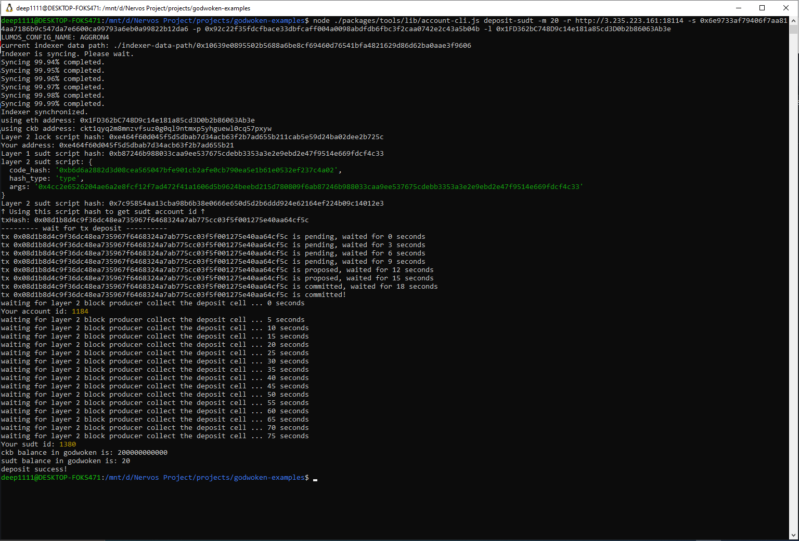

## 1. A link to the Layer 1 address you funded on the Testnet Explorer.
[https://explorer.nervos.org/aggron/address/ckt1qyq2m8mnzvfsuz0g0ql9ntmxp5yhguewl0cq57pxyw](https://explorer.nervos.org/aggron/address/ckt1qyq2m8mnzvfsuz0g0ql9ntmxp5yhguewl0cq57pxyw)
## 2. A screenshot of the console output immediately after using sudt-cli to create your SUDT tokens on Layer 1.

## 3. A link to the transaction ID created by sudt-cli on the Testnet Explorer.
[https://explorer.nervos.org/aggron/transaction/0x4376da9f6b4ceae7f202990d198bb353c7ab7869b6dd66ecd1419e839b5c722e](https://explorer.nervos.org/aggron/transaction/0x4376da9f6b4ceae7f202990d198bb353c7ab7869b6dd66ecd1419e839b5c722e)
## 4. A screenshot of the console output immediately after you have successfully submitted a deposit to Layer 2 using the account-cli tool.

## 5. The SUDT ID from the console output after executing the deposit script (in text format).
1380

<!-- node ./packages/tools/lib/account-cli.js deposit-sudt -m 20 -r http://3.235.223.161:18114 -s 0x6e9733af79406f7aa814aa7186b9c547da7e6600ca99793a6eb0a99822b12da6 -p 0x92c22f35fdcfbace33dbfcaff004a0098abdfdb6fbc3f2caa0742e2c43a5b04b -l 0x1FD362bC748D9c14e181a85cd3D0b2b86063Ab3e -->
