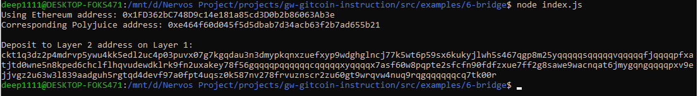

## 1. A screenshot of the console output immediately after you have successfully generated your Deposit Receiver Address.

## 2. Your Deposit Receiver Address (in text format).
ckt1q3dz2p4mdrvp5ywu4kk5edl2uc4p03puvx07g7kgqdau3n3dmypkqnxzuefxyp9wdghglncj77k5wt6p59sx6kukyjlwh5s467qgp8m25yqqqqqsqqqqqvqqqqqfjqqqqpfxatjtd0wne5n8kped6chclflhqvudewdklrk9fn2uxakey78f56gqqqqpqqqqqqcqqqqqxyqqqqx7asf60w8pqpte2sfcfn90fdfzxue7ff2g8sawe9wacnqat6jmygqngqqqqpxv9ejjvgz2u63w3l839aadguh5rgtqd4devf97a0fpt4uqsz0k587nv278frvuznscr2zu60gt9wrqvw4nuq9rqgqqqqqqcq7tk00r
## 3. The Ethereum address used to generate the Deposit Receiver Address (in text format).
0x1FD362bC748D9c14e181a85cd3D0b2b86063Ab3e
## 4. A link to the Etherscan explorer for the successful Force Bridge transaction. This can be found on Force Bridge under History→Succeed.
[https://rinkeby.etherscan.io/tx/0x6c3672e29229c22365ce7c331ef3de43dee4d9bb0daa9eac2dc04946859d16e5](https://rinkeby.etherscan.io/tx/0x6c3672e29229c22365ce7c331ef3de43dee4d9bb0daa9eac2dc04946859d16e5)
## 5. A link to the Nervos explorer for the successful Force bridge transaction. This can be found on Force Bridge under History→Succeed.
[https://explorer.nervos.org/aggron/transaction/0xabc5d30743790333962f117f8dcd5ae889482b6bbad3e9d676e1359c0eeaac8b](https://explorer.nervos.org/aggron/transaction/0xabc5d30743790333962f117f8dcd5ae889482b6bbad3e9d676e1359c0eeaac8b)
